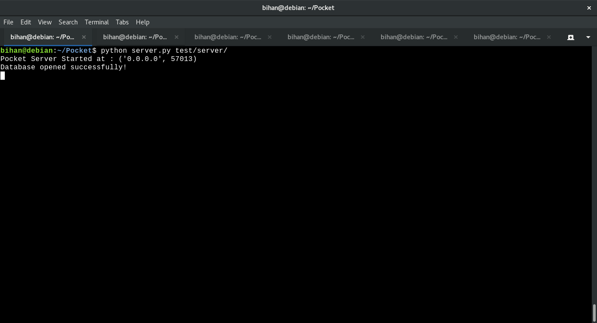
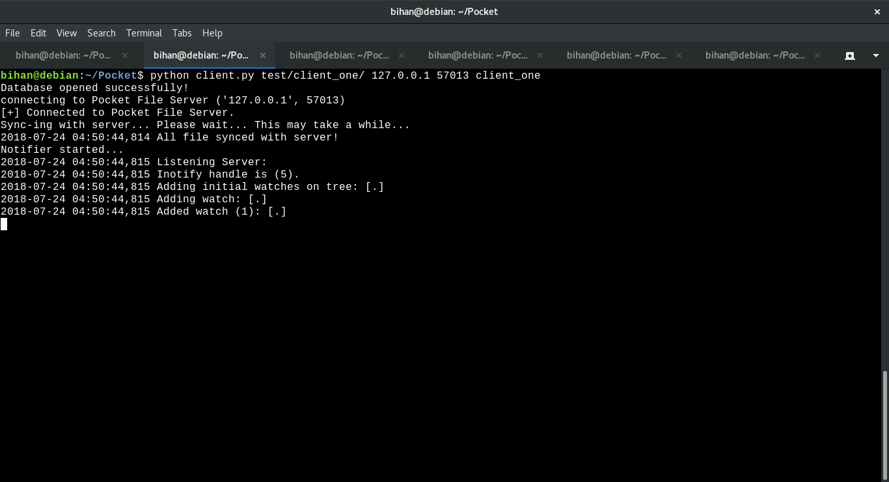

# pocket : A simple file synchronisation server-client application 

**Introduction**:

pocket is small dropbox-like client that keeps your files synced. This is a collaborative class project of Operating Subject Indian Statistical Institute, Kolkata for M.Tech CS Batch 2017-19.

****
**Current Features**

1. Upload files from local machine to server that are not present.
2. Real-time synchronisation of existing files with the server. (updation, deletion, rename etc.)
3. Single user multi-client support.

**Features that can be Added**

1. Multiple user support.

**Dependency:**

To Run, Test you need these :

1. librsync :
     >For Debian/Ubuntu 

      1. run `sudo apt-get install librsync-dev`. (for librsync library)      
      2. run `sudo pip install python-librsync`.  (for python wrapper)

2. inotify  :
      >For Debian/Ubuntu
      
      1. run `sudo apt-get install inotify-tools`.   (for inotify library)      
      2. run `sudo pip install inotify`  .   (for python wrapper)

Otherwise, you can install librsync and inotify library and then            
run `$sudo python setup.py install` to install the python wrappers.

**Running**

This software has following assumptions:  
      1. The contents of the user directory can only be modified when the application is running. 
      2. Different clients follow same timezone since they belong to same user. 
      3. Clients must run on different machines as suggested by name. 

##### Running Server 

##### Running Client 

****
**Credits**

Credits for the open-source library used in this project: 
https://github.com/dsoprea/PyInotify    (pynotify) 
https://github.com/smartfile/python-librsync    (librsync)
